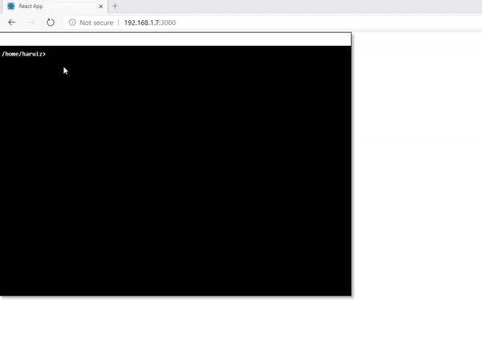

# R-Terminal

> Reactjs Terminal Component

[](https://www.npmjs.com/package/rterminal) [](https://standardjs.com)

## Install

```bash
npm install --save rterminal
```
## Usage



```jsx
import React from 'react';
//import logo from './logo.svg';
import './App.css';
import SocketIO from "socket.io-client";
import Terminal from "./components/Terminal";


class App extends React.Component{
    constructor(props) {
        super(props);
        this.endpoint = "<ws endpoint>";
        this.socket = SocketIO(this.endpoint);
        this.terminalRef = React.createRef();
        this.terminal = null
    }
    componentDidMount() {
        this.terminal = this.terminalRef.current;
        this.socket.on("connect", () =>{
            console.log(`connected to ${this.endpoint}`);
            this.socket.on("pwd", (path)=>{
                this.terminal.chdir(path);
                this.terminal.start()
            })
        });
    }
    onCommand=(cmd)=>{
        if(this.socket){
            this.socket.emit("cmd", cmd,
               (error, stdout, stderr)=>{
                    if(error && stderr){
                        this.terminal.print(stderr,"red");
                        return;
                    }
                    this.terminal.print(stdout);
            })
        }
    }
    render() {

        return(
            <React.Fragment>
                <h>React Terminal</h>
                <Terminal ref={this.terminalRef} onCommand={this.onCommand} style={{width:800 , height:600, minHeight: 500, minWidth: 800}} />
            </React.Fragment>
        )
    }

}

export default App;
```

## License

MIT © [haruiz](https://github.com/haruiz)
